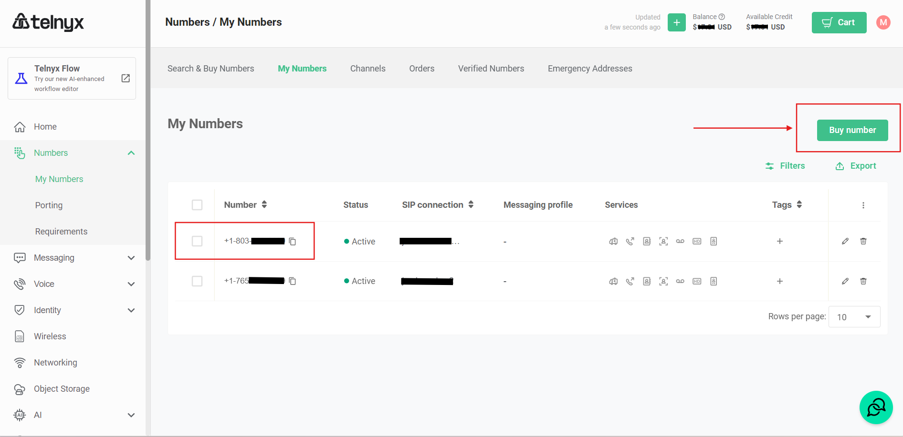
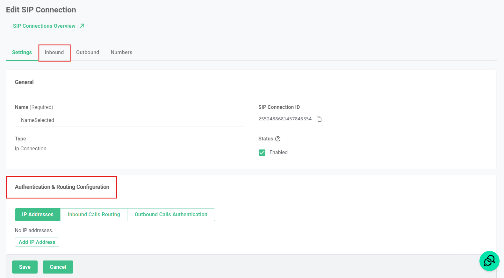

---
layout:
  title:
    visible: true
  description:
    visible: true
  tableOfContents:
    visible: true
  outline:
    visible: true
  pagination:
    visible: false
---

# Add Telnyx Phone Numbers

This document provides a guide on a Telnyx account, purchasing phone numbers, retrieving your SID configuration, and using these data in Voxia’s app.

### Step 1: Buy a Telnyx phone number

* Go to the _**Numbers**_ tab on your Telnyx left sidebar.
* If you don't already have a phone number, click on the `Buy number` to get a phone number in Telnyx.

<figure><figcaption></figcaption></figure>

### Step 2: Create a SIP connection

* Go to the **Voice** tab and select **SIP Trunking** to create a SIP Connection.
* Click on the **Create SIP Connection** button to add a new connection.
* Select a Name and **IP Address** as the connection Type.
* In the **Authentication & Routing Configuration** section add Voxia's public IP and the default port **5060.**


Voxia's public IP address is `35.245.182.192`


<figure><figcaption></figcaption></figure>

Go to _**Inbound**_ to continue the settings.

* According to the campaign region, set the SIP Region according to [Telnyx documentation](https://sip.telnyx.com/).

### Step 3: Configure Phone Numbers

Click on the `Numbers`tab to select the aquired telephone number that will be used for the inbound campaign.


To set up the Telnyx number in Voxia, go to the [BYOC documentation](bring-your-own-carrier.md).

